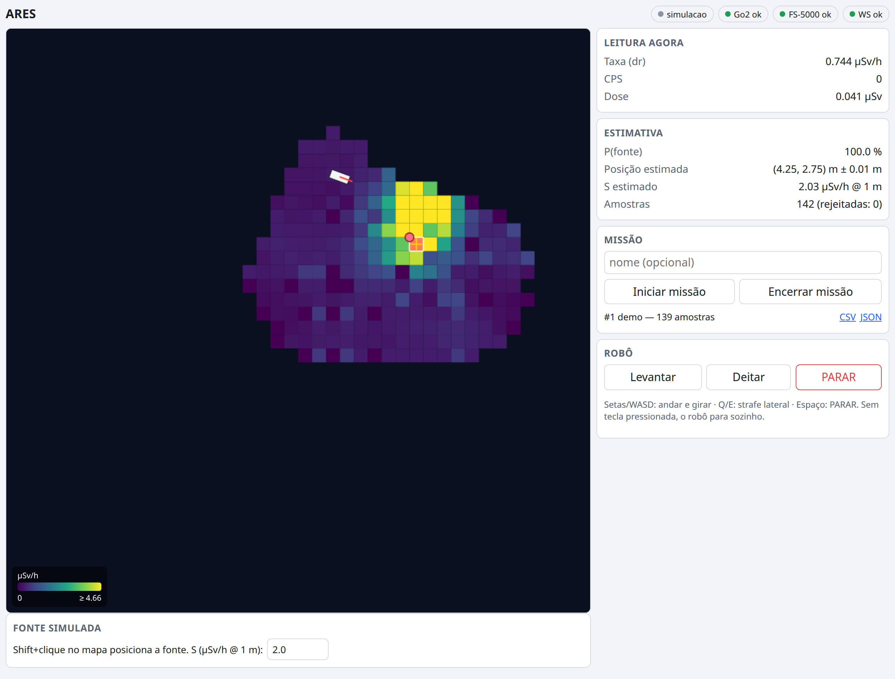
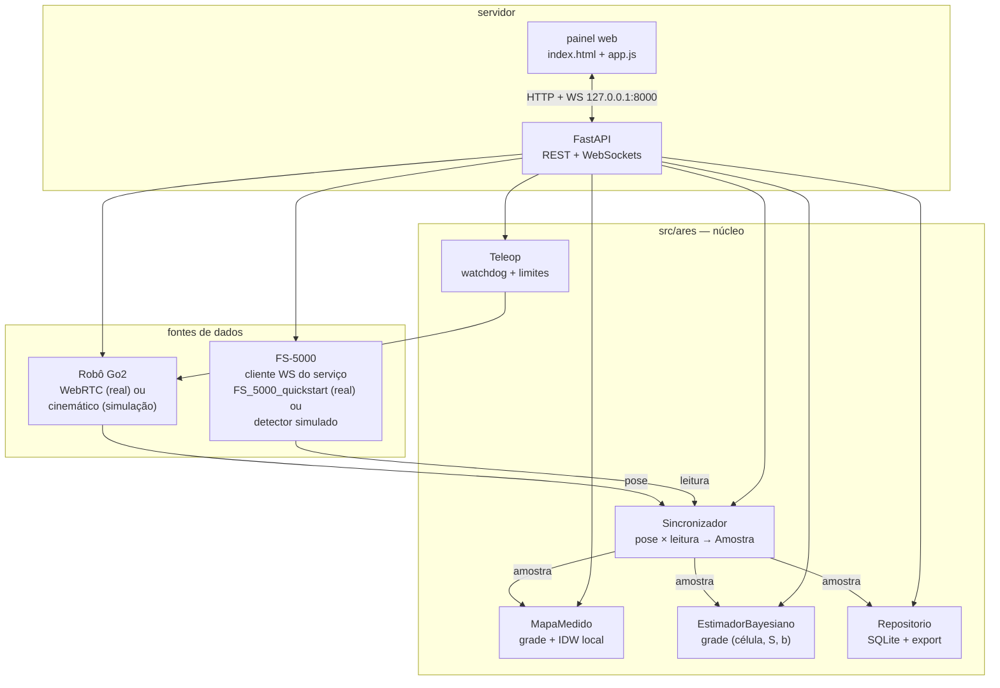
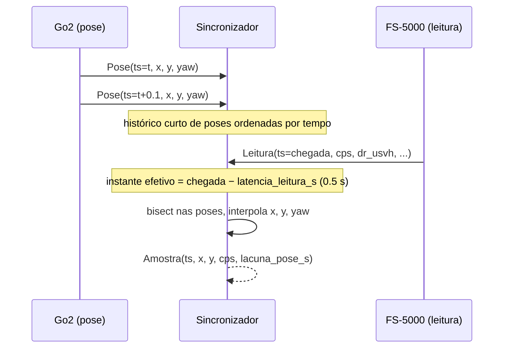
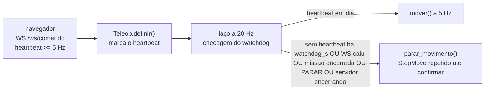
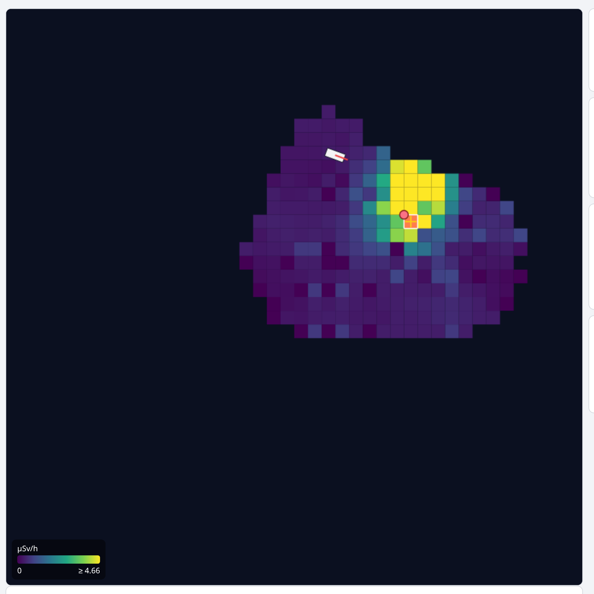
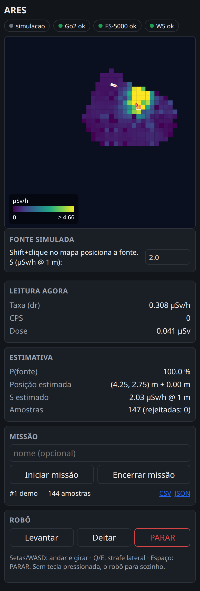

# ARES — mapeamento de radiação com o Go2

> Esta branch adiciona o Radiacode 110 à estrutura da integração Go2. Veja
> [RADIACODE_GO2_WIFI.md](RADIACODE_GO2_WIFI.md) para a entrada USB independente,
> aquisição sem calibração e limites da validação. Os defaults do FS-5000
> e a documentação original abaixo permanecem disponíveis.


Mapeia radiação andando com o cão-robô **Unitree Go2 EDU**: combina a pose
do robô (odometria) com as leituras de um medidor **Bosean FS-5000**,
desenha em tempo real o percurso, o mapa de calor medido e a **estimativa
bayesiana da posição de uma fonte** com incerteza — tudo num painel web,
com teleoperação do robô no mesmo lugar.



- **Tempo real**: taxa de dose, CPS, dose acumulada, atualizados a cada
  leitura do detector.
- **Mapa medido**: grade 0,5 m com a taxa média por célula, interpolada
  localmente (sem extrapolar para áreas nunca visitadas).
- **Estimativa da fonte**: grade bayesiana (Poisson) sobre a posição, com
  `P(fonte)`, posição MAP/média, desvio e região de 95% — condicionada ao
  percurso já feito, não só aos dados (seção 3 de
  [`docs/modelo.md`](docs/modelo.md)).
- **Teleop com segurança física**: setas/WASD, watchdog de heartbeat,
  limites de velocidade, `PARAR` sempre disponível.
- **Dois modos**: `simulacao` (robô cinemático + campo de radiação
  sintético, sem hardware) e `real` (Go2 por WebRTC + FS-5000 real).
- **Missões gravadas** em SQLite, com export CSV/JSON.

Reimplementação sobre dois projetos já validados em hardware:
[`go2_wifi_quickstart`](../go2_wifi_quickstart) (Go2 por wifi, WebRTC) e
[`FS_5000_quickstart`](../FS_5000_quickstart) (serviço local do FS-5000).

---

## Sumário

1. [Como funciona](#1-como-funciona)
2. [O modelo físico e estatístico, em poucas palavras](#2-o-modelo-físico-e-estatístico-em-poucas-palavras)
3. [Pré-requisitos](#3-pré-requisitos)
4. [Quickstart em simulação](#4-quickstart-em-simulação)
5. [Operação real, resumo](#5-operação-real-resumo)
6. [Guia do painel](#6-guia-do-painel)
7. [API](#7-api)
8. [Segurança](#8-segurança)
9. [Limitações](#9-limitações)
10. [Estrutura do projeto](#10-estrutura-do-projeto)
11. [Testes](#11-testes)

---

## 1. Como funciona

O ARES é um monolito FastAPI de um único event loop (como os dois projetos
base): um orquestrador central liga o robô, o detector, o sincronizador, o
mapa, o estimador e a gravação da missão.



### Sincronização pose × CPS

A pose chega numa taxa própria (WebRTC ou simulação); o CPS chega ~1 Hz do
FS-5000, e cobre o **segundo anterior** à sua chegada — o instante efetivo
de cada leitura é `ts_chegada − 0,5 s`. O sincronizador interpola a pose
nesse instante (nunca no instante de chegada):



`Amostra.ts` é o instante de **chegada** da leitura (igual a `Leitura.ts`),
não o corrigido — só `x, y` (a posição do detector) usam o instante
efetivo `ts − latencia_leitura_s`, que é quando a contagem realmente
aconteceu.

### Ideia do estimador

Cada amostra (posição do detector + contagem daquele segundo) atualiza uma
grade de hipóteses — posição da fonte × intensidade `S` × fundo `b` — por
verossimilhança de Poisson, de forma incremental (sem reprocessar o
histórico inteiro a cada passo). O resultado publicado é sempre a
posterior — nunca os dados brutos. Matemática completa, incluindo os
critérios de detectabilidade, em [`docs/modelo.md`](docs/modelo.md).

### Laço de segurança do teleop



Latência de parada no pior caso, do último heartbeat até o `StopMove` ser
**enviado**: `watchdog_s + 1/verificacao_hz` ≈ 0,55 s (a confirmação em si
pode levar até 1 s a mais, mas o comando já chegou ao robô). Estrutura de
diretórios completa e protocolos `Robo`/`FonteRadiacao` em
[`docs/arquitetura.md`](docs/arquitetura.md).

## 2. O modelo físico e estatístico, em poucas palavras

Medido em ~2 h de dados reais do FS-5000 (7411 leituras): o **CPS**
(contagem por segundo) é Poisson quase perfeito (variância/média = 1,03) e
praticamente independente entre segundos (autocorrelação 0,02); o **DR**
(taxa exibida pelo aparelho) é uma média móvel de ~30 s, fortemente
autocorrelacionada (0,99 no passo 1). Por isso o estimador usa o CPS bruto,
não o DR — o DR só aparece no painel para leitura humana. Calibração
medida: **k = 2,61 cps por µSv/h** (config `cps_por_usvh`, padrão 2,6).

Modelo de campo: taxa esperada no detector `μ = b + S/(r² + h²)`, com `S`
em µSv/h a 1 m, `b` o fundo, `r` a distância horizontal até a fonte e `h` a
altura relativa do detector. Contagem do segundo: `c ~ Poisson(k·T·μ)`.

O estimador varre uma grade (posição × `S` × `b`) e acumula a
log-verossimilhança de Poisson incrementalmente. `P(fonte)` só considera
hipóteses que o **percurso já feito** conseguiria distinguir de um fundo
constante — sem isso, cobertura parcial e fontes fracas/distantes puxam a
probabilidade para um piso artificial. Detalhes completos, com as fórmulas
e os dois critérios de detectabilidade, em
[`docs/modelo.md`](docs/modelo.md).

## 3. Pré-requisitos

- Linux, Python **3.10+** (testado em 3.12).
- Modo simulação: nenhum hardware.
- Modo real: Go2 EDU (fw ≤ 1.1.14, LocalAP) na wifi do PC, e o serviço
  [`FS_5000_quickstart`](../FS_5000_quickstart) rodando com o FS-5000
  conectado.
- Docker + Compose, opcional.

## 4. Quickstart em simulação

### No host

```bash
pip install -e .
python3 -m ares --modo simulacao
# ou, sem instalar o pacote:
PYTHONPATH=src ARES_MODO=simulacao python3 -m ares
```

Abra `http://127.0.0.1:8000`. Clique **Iniciar missão**, ande com
setas/WASD, e (opcional) `Shift`+clique no mapa para reposicionar a fonte
simulada.

### Em Docker

```bash
docker compose --profile sim up -d --build ares-sim
curl -s http://127.0.0.1:8000/api/estado
docker compose --profile sim down
```

## 5. Operação real, resumo

1. Conecte o PC na wifi do Go2 (LocalAP, `192.168.12.1`) — só uma conexão
   WebRTC por vez.
2. Suba o serviço do FS-5000 (`FS_5000_quickstart`) com o aparelho
   conectado por USB.
3. Suba o ARES em modo real:
   ```bash
   docker compose --profile real up -d ares-real
   # ou: PYTHONPATH=src ARES_MODO=real python3 -m ares
   ```
4. Confirme no painel que **Go2** e **FS-5000** estão verdes antes de
   iniciar a missão.

Passo a passo completo, com todas as ressalvas de segurança, em
[`docs/operacao_real.md`](docs/operacao_real.md).

## 6. Guia do painel


- **Topo**: modo (`simulacao`/`real`) e o estado de Go2, FS-5000 e do
  WebSocket do painel — verde conectado, cinza/vermelho reconectando.
- **Mapa** (esquerda): trajeto, grade de calor medida (escala de cor: 0 até
  o **percentil 95** das células medidas — valores acima saturam na cor mais
  intensa, para uma fonte forte não "lavar" o resto do mapa), marginal da
  posição estimada, região de 95% e a cruz da posição MAP.

  

- **Leitura agora**: taxa (DR), CPS e dose no instante.
- **Estimativa**: `P(fonte)`, posição estimada, `S` estimado, número de
  amostras (e rejeitadas) — e os alertas do estimador (`s_no_limite`,
  `b_no_limite`, `fonte_na_borda`) quando aplicável.
- **Missão**: iniciar/encerrar, histórico de missões com export CSV/JSON.
- **Robô**: Levantar / Deitar / **PARAR**; teclado: setas ou WASD para
  andar/girar, Q/E para strafe lateral, espaço para PARAR.
- Em `modo=simulacao`, uma seção extra permite reposicionar a fonte
  (`Shift`+clique no mapa).

O painel segue o modo escuro do sistema e funciona no celular:

<p align="center"></p>

## 7. API

| método | rota | faz |
|---|---|---|
| GET | `/api/estado` | snapshot completo (robô, radiação, missão, pose, leitura, resultado, mapa) |
| POST | `/api/missao/iniciar` | inicia missão (`{"nome": "..."}` opcional) |
| POST | `/api/missao/encerrar` | encerra a missão em andamento |
| GET | `/api/missoes` | lista missões gravadas |
| GET | `/api/missoes/{id}` | detalhe de uma missão |
| GET | `/api/missoes/{id}.json` | export JSON |
| GET | `/api/missoes/{id}/amostras.csv` | export CSV |
| POST | `/api/simulacao/fonte` | reposiciona a fonte simulada (`{"x","y","s"}`) |
| POST | `/api/robo/{levantar\|deitar\|parar}` | ação imediata no robô |
| GET | `/camera.mjpg` | stream MJPEG da câmera (se disponível) |
| WS | `/ws` | snapshot inicial, depois eventos `pose`/`leitura`/`amostra`/`estimativa`/`mapa`/`estado` |
| WS | `/ws/comando` | heartbeat de teleop `{vx, vy, vyaw}` (≥ 5 Hz) |

Só aceita conexões de `localhost`/`127.0.0.1` (`TrustedHostMiddleware` +
checagem de `Origin` em POST e WebSocket), igual ao `FS_5000_quickstart`.

## 8. Segurança

- O robô só anda enquanto o navegador manda heartbeat de velocidade
  (≥ 5 Hz) pelo `WS /ws/comando`. Sem heartbeat por `watchdog_s` (padrão
  0,5 s), WS caído, missão encerrada, `PARAR` ou servidor encerrando →
  `StopMove`, repetido até confirmar.
- Limites de velocidade (configuráveis, sempre aplicados pelo teleop):
  `|vx| ≤ 0,5 m/s`, `|vy| ≤ 0,3 m/s`, `|vyaw| ≤ 1,0 rad/s`.
- `PARAR` (botão ou espaço) e as ações **Levantar**/**Deitar** cancelam
  qualquer movimento em andamento antes de agir.
- Latência de parada no pior caso: `watchdog_s + 1/verificacao_hz` ≈
  0,55 s até o comando ser enviado (detalhes na seção 1 e em
  [`teleop.py`](src/ares/teleop.py)).
- Sem rota autônoma: o robô só anda com alguém ativamente no controle.
- Robô ou FS-5000 indisponíveis: o app sobe assim mesmo, mostra o
  componente como indisponível e tenta de novo com backoff (até 10 s); a
  missão só pode ser **iniciada** com os dois conectados.
- **Ligar num endereço que não seja loopback é uma decisão explícita**: o
  painel não tem autenticação nenhuma e inclui o teleop do robô, então
  `python -m ares --host <endereço-de-rede>` (ex.: `0.0.0.0` ou o IP do
  host na rede) é recusado por padrão — qualquer um alcançando esse
  endereço poderia comandar o robô. Use `--permitir-rede` só se isso for
  intencional (ex.: controlar de outro dispositivo numa rede confiável).

## 9. Limitações

- **Deriva de odometria**: a posição do robô vem só da odometria do Go2
  (sem SLAM/correção externa); em percursos longos o erro acumulado desloca
  o mapa e a estimativa.
- **Região de 95% é condicional ao modelo** (fonte pontual estática, pose e
  sincronização exatas) — otimista na presença de erro de odometria ou de
  tempo; ver [`docs/modelo.md`](docs/modelo.md#limitação-região-de-95-é-condicional-ao-modelo).
- **Modo real do Go2 não validado em hardware neste projeto**: os helpers
  de WebRTC (`src/ares/robo/go2.py`) são portados do `go2_wifi_quickstart`,
  já validado lá com o robô real — mas a integração completa do ARES
  (teleop + estimador + missão, com o robô andando) ainda não foi testada
  com o Go2 físico neste projeto. Ver [`docs/operacao_real.md`](docs/operacao_real.md#8-o-que-ainda-não-foi-validado).
- **Firmware do Go2 ≥ 1.1.15** exige chave AES (`GO2_AES_KEY`); suportado
  na configuração, mas não testado.
- Fora do escopo: rota autônoma, SLAM, dois detectores simultâneos no
  estimador, fonte móvel, filtro de partículas.

## 10. Estrutura do projeto

```
ares-radiation-mapper/
├── README.md
├── pyproject.toml              # setuptools, pacote em src/, `ares = ares.__main__:main`
├── requirements.txt             # fastapi, uvicorn, numpy, websockets
├── requirements-real.txt        # + driver do Go2 (--no-deps) e opencv headless
├── requirements-dev.txt         # + pytest, httpx
├── Dockerfile                    # python:3.12-slim
├── docker-compose.yml            # ares-sim (profile sim), ares-real (profile real)
├── src/ares/
│   ├── __main__.py               # `python -m ares`
│   ├── config.py                  # Config + variáveis de ambiente
│   ├── modelos.py                 # Pose, Leitura, Amostra
│   ├── sincronizacao.py            # pose × leitura → Amostra
│   ├── mapa.py                     # grade medida + IDW
│   ├── estimativa.py               # estimador bayesiano em grade
│   ├── missao.py                   # SQLite + export
│   ├── orquestrador.py             # fiação central
│   ├── teleop.py                    # watchdog + limites
│   ├── robo/ · radiacao/ · simulacao/
│   └── servidor/                   # app.py (FastAPI) + static/ (painel)
├── tests/                          # um arquivo por módulo
└── docs/
    ├── arquitetura.md
    ├── modelo.md
    ├── operacao_real.md
    └── img/
```

Mais detalhes de arquitetura, protocolos e o laço de segurança em
[`docs/arquitetura.md`](docs/arquitetura.md).

## 11. Testes

```bash
pip install -r requirements-dev.txt
python3 -m pytest -q -W error
```

Nenhum teste toca hardware nem abre rede externa; o simulador (robô e
detector) cobre a integração ponta a ponta. `pytest.ini` já aponta
`pythonpath = src` e `testpaths = tests`.
