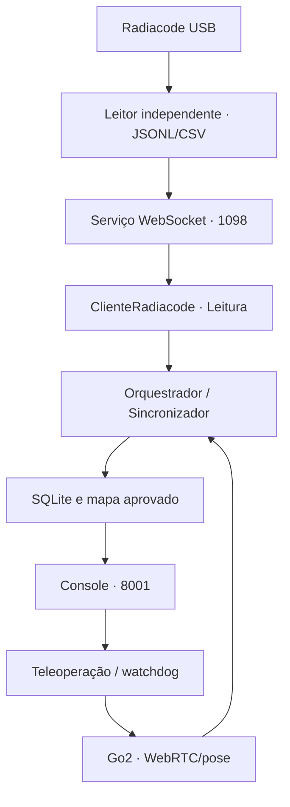

# ARES Console 1.0.2 — reunião e ensaio Go2/Radiacode

Referência para 08/10/2026. A revisão de preparação acrescenta documentação,
testes existentes da integração e verificações no CI. O programa de operação,
o mapa, o gradiente, a paleta, o layout e a correção de permanência são os mesmos
da versão 1.0.2 aprovada. O software está preparado para o ensaio; a validação
conjunta Radiacode/Go2 físico será feita nele.

## Decisões para a reunião

1. Validar primeiro FS-5000 + Go2 no trabalho existente do Werik.
2. Encerrar aquele controlador antes de abrir o ARES Console para o mesmo Go2.
3. Confirmar Go2 real com detector simulado; depois testar os dois reais.
4. Conferir montagem, offset, latência da taxa e firmware/chave com a equipe.
5. Salvar uma missão curta e seus registros antes de ampliar a duração.

O console atual destina seus modos USB ao Radiacode. O teste do FS-5000 deve
continuar no sistema original; não há seleção de FS-5000 no console unificado.

## Compatibilidade com o framework do Werik

Referências examinadas: os quickstarts de Wi-Fi e FS-5000 fornecidos e a branch
[`ares-wifi`, revisão 84f9148](https://github.com/megadanielsj-commits/ares-radiation-mapper/tree/84f9148d1da6b7b3aa84b177b09a30d2631ecb8f).
O quickstart Wi-Fi registra teste físico no Go2; a documentação da integração
original informa que a combinação completa ainda dependia de teste físico.
Não é possível deduzir a eliminação de todo atraso apenas desses registros.

| Componente | Resultado da comparação |
|---|---|
| Driver Go2/WebRTC, compatibilidade e interface do robô | Idênticos à referência original |
| Sincronizador e teleoperação/watchdog | Idênticos à referência original |
| Interface de radiação e cliente FS-5000 | Idênticos à referência original |
| Modelo `Leitura`/`Amostra` | Admite taxa/dose ausentes; não transforma ausência em zero |
| Orquestrador | Mantém os métodos de recepção, sincronização, ciclos e encerramento; acrescenta seleção do Radiacode e metadados/fluxo sem calibração |
| Persistência | Mantém registro de poses, leituras, amostras e CSV; acrescenta metadados de missão e exportação JSON das entradas |
| Mapa/interface | Camada aprovada do console sobre o runtime; usa taxa reportada, sem converter CPS em dose |

Os 30 arquivos versionados de `vendor/go2_runtime/src/ares` são idênticos à
referência adaptada `4048f7c8b4ffe2cc0f604a8bae1b89d4763aa4f2`.
Essa referência já incorpora a entrada Radiacode e as mudanças aditivas acima;
não deve ser confundida com o original sem adaptação.

O módulo USB continua sendo o único dono do detector. O cliente Radiacode
implementa a mesma interface `FonteRadiacao` e reutiliza o ciclo WebSocket do
cliente FS-5000. Poses e leituras entram nos mesmos callbacks do orquestrador.
O processamento do mapa segue em um trabalhador separado do recebimento e da
teleoperação, com encerramento que espera as amostras pendentes. A fila desse
trabalhador é ordenada e não tem limite; filas de publicação USB são limitadas.
Por isso o teste prolongado deve verificar atraso, além de conexão.



A sincronização mantém `posição(ts_da_leitura − latencia_leitura_s)`, interpolação
da odometria e aplicação do offset no referencial do robô. Padrões: 0,5 s e
offset (0,0) m. A taxa tem timestamps próprios de recebimento e verificação de
idade, mas pode ter média interna distinta da contagem de 1 s. A adequação da
latência para esse canal deve ser medida no ensaio, sem alterar o sincronizador.

## Evidências e o que resta validar

| Verificação | Situação em 02/10/2026 |
|---|---|
| Pacote/console | 144 testes Python passaram |
| Runtime Go2/Radiacode | 209 testes Python passaram; fontes incluídas no pacote |
| JavaScript | 13 testes do console/USB e 6 da referência passaram |
| Integridade do mapa/núcleo | 56 arquivos protegidos passaram |
| Lint/tipos | Passaram; 76 módulos verificados pelo mypy |
| Quatro modos no navegador | Passaram em software, com substitutos para hardware indisponível |
| Radiacode USB + robô virtual | Funcionamento informado pelo operador na base 1.0.1; a 1.0.2 muda somente rótulos SI |
| Docker do console | Preparado; construção/saúde devem ser confirmadas no computador do teste ou pelo CI |
| Radiacode + Go2 físico, pose e resposta temporal | Pendente do ensaio conjunto |
| Branch oficial no GitHub | Publicação preparada; ainda ausente na consulta desta revisão |

O relatório reproduzível está em `validation/preparacao_ensaio_1.0.2.json` e
os resultados detalhados em XML. Sem Docker Engine, Radiacode ou Go2 neste
ambiente, não foi realizado build Docker nem teste físico aqui.

## Antes da reunião, no computador de operação

Use o ZIP `ARES_Console_1.0.2_Ensaio.zip`. Ele extrai para a pasta oficial da
1.0.2, preservando a identidade da versão. Com internet disponível:

```bash
python3 -m zipfile -e "$HOME/Downloads/ARES_Console_1.0.2_Ensaio.zip" "$HOME" &&
cd "$HOME/ARES_Console_Oficial_1.0.2" &&
bash ares-console iniciar
```

Abra **http://127.0.0.1:8001**. A imagem é construída se ainda não existir.
Se já estiver construída como `ares-operator-console:1.0.2`, pode ser reutilizada:
esta preparação não muda arquivos executáveis do produto.

| Modo do menu | Robô | Detector | Uso |
|---|---|---|---|
| Simulação completa | Virtual | Sintético | Trajetória, fonte, mapa, parada e exportação |
| Robô simulado | Virtual | Radiacode USB | Conferência do canal real e registro independente |
| Detector simulado | Go2 Wi-Fi | Sintético | Conferência de pose e controle no laboratório |
| Equipamentos reais | Go2 Wi-Fi | Radiacode USB | Ensaio conjunto |

Faça uma missão curta em **Simulação completa**, encerre e baixe os dados.
Depois conecte somente o Radiacode, feche outros leitores e selecione **Robô
simulado**. Confirme USB online, CPS/CPM e taxa disponível. Compare a taxa com o
visor na mesma unidade; `126,52 nSv/h` equivale a `0,12652 µSv/h`. Registre e
exporte uma missão com trajetória virtual. Guarde os arquivos sem atribuir
essas coordenadas à localização física do detector.

Publique a branch preparada, ainda com internet:

```bash
cd "$HOME/ARES_Console_Oficial_1.0.2" && bash PUBLICAR_CONSOLE_GITHUB.sh
```

Após publicar, envie à equipe o link da branch:
https://github.com/megadanielsj-commits/ares-radiation-mapper/tree/release/ares-console-1.0.2

Confira os checks de Actions. O script não faz merge em `main`/`ares-wifi` nem
envia dados de campo. O link só estará disponível depois dessa publicação.
Ao terminar, execute `bash ares-console parar`. Não remova a imagem preparada.
Para levar a imagem a outro computador, veja [PUBLICACAO_E_TESTE.md](PUBLICACAO_E_TESTE.md).

## No laboratório

1. Valide FS-5000 + Go2 no projeto do Werik. Encerre a missão e aquele
   controlador antes de usar este console. Mantenha somente uma sessão de
   controle WebRTC do robô.
2. Confirme firmware e configuração AES com a equipe. O quickstart foi testado
   com V1.1.11; a documentação prevê versões até 1.1.14 sem AES e informa que
   1.1.15+ pode exigir `GO2_AES_KEY`, sem validação física daquele caminho.
3. Prepare o Go2 para caminhar pelo controle oficial e conecte o computador
   ao Wi-Fi LocalAP. Confirme `ping -c 2 192.168.12.1` e inicie o console com
   `bash ares-console iniciar`, usando a imagem já construída.
4. Em **Detector simulado**, aguarde pose real, configure a fonte no referencial
   `odom` mostrado e faça uma missão breve. Verifique deslocamento, liberação da
   tecla, perda de foco e **Parar movimento**. Encerre e exporte.
5. Conecte o Radiacode e escolha **Equipamentos reais**. Aguarde pose e USB
   online, com taxa atual coerente com o visor. Faça uma missão de 10 minutos
   com deslocamento, parada e retorno a uma posição conhecida.
6. Confira crescimento das medições posicionadas, atraso estável e exportação
   de `ts,x,y,dr_usvh,cpm,cps,lacuna_pose_s`. Confirme montagem, offset e latência
   da taxa. Para ajustar parâmetros existentes, pare e reinicie com os valores
   medidos, por exemplo:

```bash
bash ares-console parar
ARES_LATENCIA_LEITURA_S=0.5 ARES_OFFSET_DETECTOR=0,0 bash ares-console iniciar
```

O exemplo mantém os padrões; não substitui medição da montagem. Com o robô
parado e a equipe observando, teste perda/retomada de USB. Leituras antigas não
devem reaparecer como atuais; ausência de taxa não deve virar zero nem CPS.
Só então amplie a duração do ensaio.

## Dados para guardar e diagnóstico

Encerre pelo botão **Encerrar e salvar**, baixe o ZIP e preserve toda a pasta
`resultados/console`. Ela contém bancos e missões por modo, além de
`usb/service.log` e sessões USB com `session.json`, `counts_1s.jsonl`, registros
brutos, CSV e espectros disponíveis. Fechar a página não encerra a aquisição.

```bash
bash ares-console verificar
sudo ss -ltnp '( sport = :8001 or sport = :1098 )'
lsusb
```

Se 1098 estiver ocupada, encerre o leitor anterior pelo iniciador dele. Para
USB/permissão, use os diagnósticos incrementais já fornecidos. Não abra outro
leitor em paralelo. Para investigar taxa ausente, confira unidade bruta `R/h`,
fator 10.000 e conversão disponível em `session.json`, timestamps próprios da
taxa em `counts_1s.jsonl` e o motivo informado pelo serviço. Detalhes em
[CONTRATO_USB_WEBSOCKET.md](docs/CONTRATO_USB_WEBSOCKET.md).

Taxa, contagens e timestamps permanecem numéricos e com precisão original.
CPS posicionado representa a contagem reconstruída de 1 s; CPM é 60 × CPS.
A dose da missão é uma integral das taxas válidas, separada da dose histórica
do detector. Não aplicar fator de calibração do FS-5000 ao Radiacode.

## Reproduzir os testes de desenvolvimento

No Python 3.12 de desenvolvimento, instale as dependências e execute as suítes
separadamente, para não misturar módulos homônimos dos dois projetos:

```bash
python -m pip install -e '.[dev,fs5000,radiacode-usb]'
python -m pip install -r vendor/go2_runtime/requirements-go2-wifi.txt
python -m pip install --no-deps unitree_webrtc_connect==2.2.0
PYTHONPATH=src python -m pytest -q tests tools/operator_console/test_console.py tools/operator_console/test_stationary_map.py tools/source_simulation/test_demo.py
PYTHONPATH=vendor/go2_runtime/src python -m pytest -q vendor/go2_runtime/tests
node --test tools/operator_console/console.test.cjs tests/radiacode/dashboard_usb.test.cjs vendor/go2_runtime/tests/approved_dashboard.test.cjs
python -m tools.operator_console.check_map_lock
```

Os testes do painel de referência verificam o adaptador histórico; a interface
atual e o mapa por taxa são verificados pelos testes do console. Nenhum desses
comandos exige movimento do Go2 físico.
