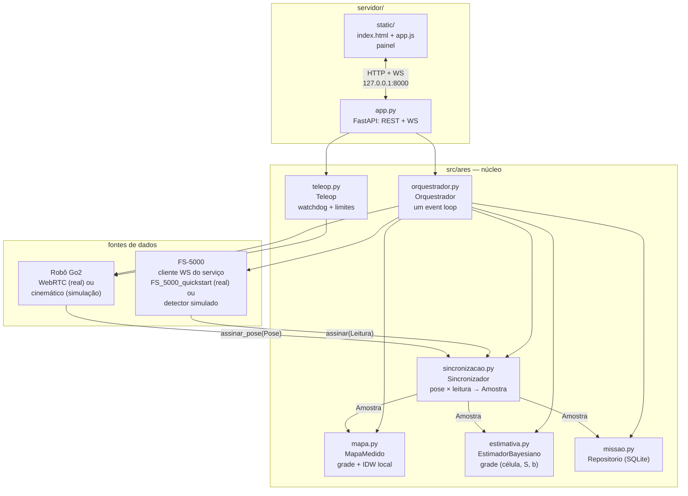
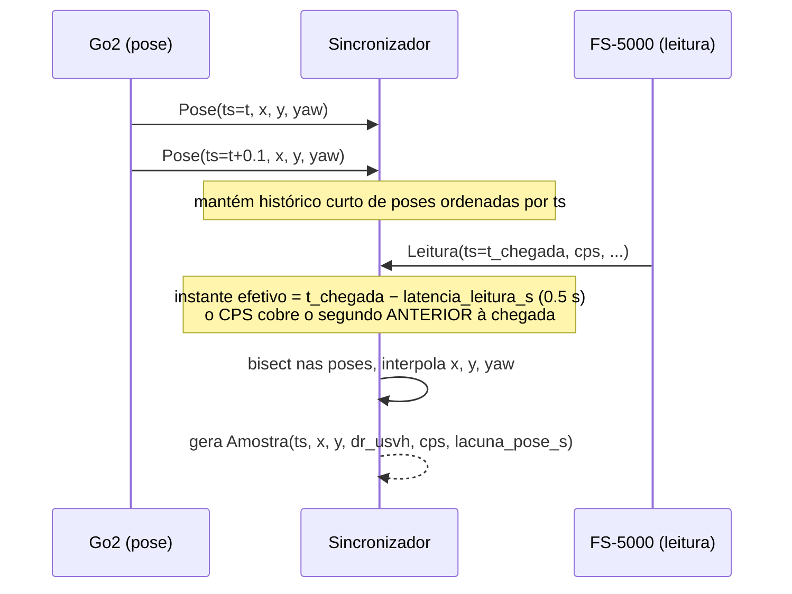
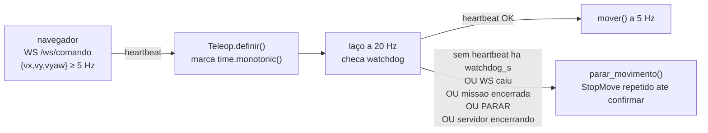

# Arquitetura

O ARES é um monolito FastAPI de um único event loop — igual aos dois
projetos base (`go2_wifi_quickstart` e `FS_5000_quickstart`): sem fila
externa, sem processo separado, um `orquestrador` central que costura as
peças.

## Componentes e fluxo de dados



Cada seta de `assinar_*` é um callback síncrono chamado pelo driver do
robô/detector assim que a pose ou leitura chega; o orquestrador os registra
uma vez na inicialização e nunca abre conexão direta com o hardware.

## Protocolo `Robo` e `FonteRadiacao`

Real e simulado implementam a mesma interface (`Protocol`, sem herança
obrigatória), então o orquestrador nunca sabe qual dos dois está por trás:

```python
class Robo(Protocol):
    async def iniciar(self) -> None: ...
    async def encerrar(self) -> None: ...          # StopMove se possível, depois fecha
    def assinar_pose(self, cb) -> None: ...
    async def mover(self, vx, vy, vyaw) -> None: ...
    async def parar_movimento(self) -> None: ...
    async def levantar(self) -> None: ...
    async def deitar(self) -> None: ...
    def estado(self) -> dict: ...                  # {"conectado": bool, "erro": str|None, ...}

class FonteRadiacao(Protocol):
    async def iniciar(self) -> None: ...
    async def encerrar(self) -> None: ...
    def assinar(self, cb) -> None: ...
    def estado(self) -> dict: ...
```

`modo=simulacao` usa `simulacao/robo_sim.py` (cinemática simples) e
`simulacao/detector_sim.py` (campo 1/r² + Poisson); `modo=real` usa
`robo/go2.py` (WebRTC, portado do `go2_wifi_quickstart`) e
`radiacao/fs5000.py` (cliente WS do `FS_5000_quickstart`, só leitura).

## Sincronização pose × CPS

A pose chega por WebRTC/simulação a uma taxa própria (não sincronizada com o
detector); o CPS chega ~1 Hz do FS-5000. O `Sincronizador` guarda as poses
recentes e, para cada leitura, busca por interpolação (bissecção nas poses
ordenadas por tempo) a posição no instante **efetivo** da leitura — não o
instante de chegada:



Se não há poses antes e depois do instante efetivo (robô parado de mandar
pose, ou lacuna maior que `lacuna_pose_max_s`), a leitura fica pendente até
chegar pose suficiente, ou é descartada se envelhecer demais (parâmetros
`historico_s` / `max_pendentes` em `sincronizacao.py`).

## Ideia do estimador

Cada `Amostra` (posição do detector + CPS daquele segundo) atualiza, de
forma incremental, uma grade de hipóteses (posição da fonte × intensidade S
× fundo b) por verossimilhança de Poisson. O resultado publicado a cada
atualização é a posterior — moda, média, região de 95%, `P(fonte)` — nunca
os dados brutos. Detalhes matemáticos em [`modelo.md`](modelo.md).

## Laço de segurança do teleop



Latência de parada no pior caso: `watchdog_s + 1/verificacao_hz` (padrão
`0,5 + 0,05 = 0,55 s`) até o `StopMove` ser **enviado**; a confirmação em si
pode levar até `tempo_limite_s` (1 s) a mais, mas o robô já recebeu o
comando pelo canal de dados nesse meio-tempo. Detalhes em
[`teleop.py`](../src/ares/teleop.py) e na seção de segurança do
[`README`](../README.md#8-segurança).

## Estrutura de diretórios

```
src/ares/
├── __main__.py         # `python -m ares`
├── config.py            # Config + variáveis de ambiente
├── modelos.py           # Pose, Leitura, Amostra (dataclasses frozen)
├── sincronizacao.py      # Sincronizador (pose × leitura → Amostra)
├── mapa.py               # MapaMedido (grade + IDW)
├── estimativa.py         # EstimadorBayesiano (grade célula×S×b)
├── missao.py             # Repositorio (SQLite) + export CSV/JSON
├── orquestrador.py       # Orquestrador (fiação central, um event loop)
├── teleop.py             # Teleop (watchdog + limites de velocidade)
├── robo/
│   ├── base.py           # Protocol Robo
│   ├── go2.py             # real (WebRTC)
│   └── ...
├── radiacao/
│   ├── base.py           # Protocol FonteRadiacao
│   ├── fs5000.py          # real (cliente WS)
│   └── ...
├── simulacao/
│   ├── robo_sim.py
│   └── detector_sim.py
└── servidor/
    ├── app.py            # FastAPI: REST + WebSockets
    └── static/            # painel (index.html, app.js)
```
