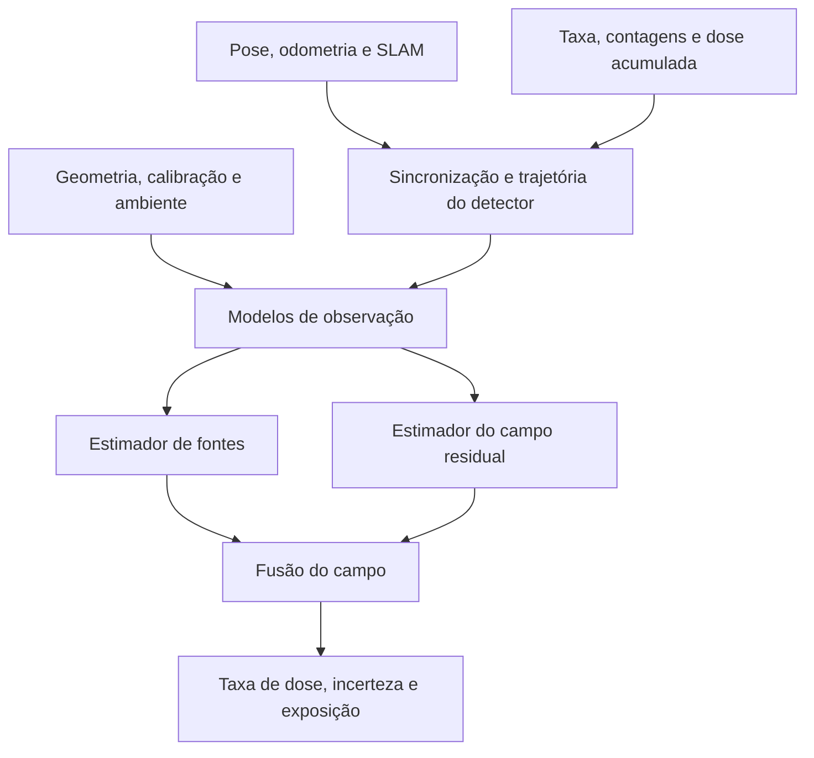

# Visão do sistema final

## Estado implementado na V0.3

A V0.3 materializa a primeira versão probabilística dessa visão:

- controle manual de um Go2 simplificado;
- 20 poses simuladas por segundo e uma leitura FS-5000 por segundo;
- integração da leitura ao longo do trecho percorrido;
- hipóteses separadas de fundo e fonte;
- filtro de partículas regularizado para uma fonte pontual estática;
- campo posterior inverso do quadrado mais correções residuais locais;
- verossimilhança por um único canal primário, com incerteza de contagem,
  calibração, pose, extrínseca e sincronização;
- posição estimada acompanhada de regiões de credibilidade e diagnóstico de
  identificabilidade;
- quadtree adaptativa e camadas independentes de incerteza, cobertura, exposição
  e probabilidade de fonte;
- recuperação fraca de intervalos ausentes pela dose acumulada.

Ainda não estão implementados o Processo Gaussiano esparso, múltiplas fontes,
resposta angular calibrada, obstáculos radiométricos completos e validação física
do SLAM.

## Princípio central

O produto final do ARES deve ser um **reconstrutor contínuo do campo
radiológico**, e não apenas um visualizador de pontos medidos.

O estado central do software será:

\[
F(x,y,t)=\text{taxa de dose estimada no ponto }(x,y)\text{ e no instante }t
\]

acompanhado de:

\[
\sigma_F(x,y,t)=\text{incerteza da estimativa}
\]

Todo dado recebido do robô, dos detectores e do ambiente só deve alterar o mapa
por meio de um modelo de observação explícito, com unidade, timestamp,
referencial espacial, qualidade e incerteza conhecidos.

Na interface, o operador verá o campo como mapa de calor. O termo matemático
`gradiente` fica reservado a \(\nabla F\), que poderá ser calculado a partir do
campo para indicar a direção de maior crescimento da taxa de dose.

## Produtos que o sistema deve manter

O mapa operacional não será uma única camada. O estado mínimo será composto por:

1. **Mapa de taxa de dose:** melhor estimativa de \(F(x,y,t)\), em µSv/h.
2. **Mapa de incerteza:** confiança espacial da estimativa.
3. **Mapa de cobertura:** onde houve medição, por quanto tempo e com qual
   qualidade de pose.
4. **Mapa de exposição da missão:** contribuição da trajetória para a dose
   acumulada pelo detector ou pelo robô.
5. **Estimativa de fonte:** posição, intensidade e região de confiança, quando o
   modelo e os dados permitirem.
6. **Pontos brutos e trajetória:** dados realmente observados, sempre
   distinguíveis das regiões inferidas.

O mapa de calor principal continuará sendo o mapa de taxa de dose. As outras
camadas explicam por que ele apresenta determinado valor e até onde é confiável.

## Localização da fonte

O procedimento desejado é mais precisamente uma **localização por ajuste do
modelo do campo** ou multilateração radiométrica, e não triangulação geométrica
simples. Um detector escalar mede intensidade, não um ângulo direto.

Para uma fonte pontual estática e um ambiente inicialmente simples:

\[
\dot D_k =
b +
S\,g_d(\alpha_k)
\frac{A(\mathbf p_k,\mathbf s)}
{\|\mathbf p_k-\mathbf s\|^2}
+
\varepsilon_k
\]

onde:

- \(\mathbf p_k\) é a posição real do detector;
- \(\mathbf s\) é a posição desconhecida da fonte;
- \(S\) é sua intensidade efetiva;
- \(b\) é o fundo;
- \(g_d(\alpha_k)\) representa a resposta angular do detector;
- \(A(\mathbf p_k,\mathbf s)\) representa atenuação e blindagem;
- \(\varepsilon_k\) agrega ruído radiológico, temporal e espacial.

A forma exata do modelo poderá usar uma taxa de referência e distância de
referência, evitando interpretar \(S\) como atividade física sem calibração.

O estimador implementado mantém partículas:

```text
source_x | source_y | log(source_strength) | log(background)
```

com verossimilhança Student-t ou de contagem. `H0` e `H1` mantêm evidências
independentes, evitando forçar a existência de uma fonte.

Evoluções posteriores:

- estado dinâmico no filtro para fonte móvel;
- múltiplas fontes com seleção de modelo;
- obstáculos e atenuação conhecidos;
- resposta angular calibrada por detector.

Uma posição estimada nunca deve ser exibida como ponto exato sem uma região de
confiança e métricas de identificabilidade.

## Fusão híbrida: modelo físico mais dados

O alvo recomendado é um mapa híbrido:

\[
F(\mathbf p,t)
=
F_{\text{físico}}(\mathbf p,t;\theta)
+
R(\mathbf p,t)
\]

`F_físico` é o campo previsto pelas fontes estimadas e `R` é o resíduo aprendido
pelas medições. Isso permite:

- extrapolar de forma física quando o modelo é justificável;
- corrigir o modelo quando paredes, blindagens ou geometria real alterarem o
  campo;
- atualizar o mapa inteiro quando a posição ou intensidade estimada da fonte
  mudar;
- preservar incerteza alta onde os dados não sustentam uma conclusão.

O IDW continua somente como baseline e correção residual local. A previsão global
é gerada pelo posterior físico; uma evolução poderá substituir o resíduo por um
Processo Gaussiano esparso quando obstáculos e blindagens justificarem esse custo.

## Medições durante movimento e permanência

Uma leitura não deve ser associada automaticamente a um ponto instantâneo. Ela
representa uma janela de integração:

\[
y_k \approx
\frac{1}{T_k}
\int_{t_{k,0}}^{t_{k,1}}
F(\mathbf p_d(t),t)\,dt
+
\varepsilon_k
\]

O software deverá:

1. conservar o início, o fim e o centro efetivo da janela;
2. reconstruir a trajetória do detector durante a janela;
3. integrar o modelo ao longo dessa trajetória;
4. considerar a incerteza da pose durante o intervalo;
5. evitar atribuir toda a leitura ao centro do robô ou a um único ponto quando
   houve deslocamento relevante.

Em uma representação por grade, cada leitura pode ser expressa como:

\[
\mathbf y=\mathbf H\mathbf f+\boldsymbol\varepsilon
\]

Cada linha de \(\mathbf H\) contém a fração do tempo de integração passada nas
células atravessadas. Assim, velocidade e permanência entram corretamente no
problema sem criar doses artificiais.

Permanecer mais tempo em um local deve:

- produzir mais contagens;
- reduzir a incerteza estatística;
- aumentar a qualidade da estimativa;
- aumentar a dose recebida durante a missão;
- **não** aumentar, por si só, a taxa de dose ambiental estimada.

## Uso da dose acumulada do FS-5000

A dose acumulada não deve ser pintada diretamente no mapa de taxa de dose. Ela
será uma restrição integral:

\[
\Delta D_j
\approx
\frac{1}{3600}
\int_{t_{j-1}}^{t_j}
F(\mathbf p_d(t),t)\,dt
\]

com \(F\) em µSv/h, tempo em segundos e \(\Delta D\) em µSv.

Usos previstos:

- conferir se a integral das taxas instantâneas reproduz a dose acumulada;
- detectar lacunas, reinicializações, duplicações e falhas de comunicação;
- restringir o campo médio ao longo de trechos com leituras instantâneas
  ausentes;
- produzir o mapa separado de exposição da missão;
- comparar a dose recebida por trajetórias alternativas.

Como uma integral de trajeto não informa sozinha em qual parte do trecho ocorreu
a exposição, ela não localiza a fonte sem as demais leituras e o modelo
espacial. A resolução e a quantização reais do campo acumulado do FS-5000
deverão ser caracterizadas antes de atribuir peso significativo a essa
restrição.

## Dois detectores e modelo do Unitree Go2

O simulador deverá evoluir para um gêmeo digital radiométrico simplificado do
Go2. Ele não precisa começar como um modelo eletromecânico completo. A primeira
versão precisa representar:

- dimensões aproximadas do corpo;
- pose completa da base;
- posição e orientação extrínseca de cada detector;
- separação, altura e inclinação dos detectores;
- resposta angular individual;
- atenuação ou sombreamento pelo corpo do robô;
- blindagens adicionadas;
- ruído, eficiência e atraso diferentes entre canais.

Cada detector continuará produzindo uma observação independente na própria pose:

\[
T_{\text{map}}^{\text{detector}_i}(t)
=
T_{\text{map}}^{\text{base}}(t)
T_{\text{base}}^{\text{detector}_i}
\]

A assimetria normalizada:

\[
A=
\frac{C_E-C_D}{C_E+C_D}
\]

será uma evidência direcional adicional, não um substituto para as duas
contagens brutas.

O ambiente de teste deverá variar sistematicamente:

```text
separação | altura | yaw | inclinação | blindagem | posição no corpo
```

e comparar as configurações por:

- erro de localização da fonte;
- acerto do lado provável;
- erro do mapa de taxa de dose;
- intervalo angular ambíguo;
- tempo necessário para convergir;
- robustez a distância, intensidade e orientação do robô.

O resultado dessa etapa será uma recomendação de montagem baseada em métricas,
antes da fabricação do suporte definitivo.

## Arquitetura-alvo



Os módulos centrais previstos são:

```text
ObservationBuilder
TrajectoryIntegrator
CumulativeDoseConstraint
SourceLocalizer
FieldEstimator
RadiationFusionEngine
MapProductService
DetectorLayoutEvaluator
```

Eles devem permanecer independentes dos adaptadores de FS-5000, Unitree SDK2,
ROS 2 e simuladores.

## Dados que podem contribuir para o campo

| Dado | Contribuição |
|---|---|
| Taxa de dose, CPS e CPM | Observação radiológica local |
| Dose acumulada | Restrição integral e validação |
| Timestamp e janela de integração | Associação correta ao trajeto |
| Pose e covariância | Localização e peso espacial da observação |
| Orientação do robô e do detector | Correção da resposta angular |
| Velocidade e permanência | Integração ao longo do caminho |
| Identidade e calibração do detector | Correção entre canais |
| Geometria e blindagem do Go2 | Modelo de sombreamento |
| Mapa físico e obstáculos | Atenuação e prevenção de interpolação através de barreiras |
| Fundo radiológico | Separação entre fundo e fonte |
| Estado do hardware e perdas | Rejeição ou redução do peso de dados ruins |

O princípio “usar tudo” não significa atribuir peso igual a tudo. Um dado só
altera o campo se houver uma relação física ou estatística declarada entre ele e
a grandeza estimada.

## Evolução recomendada

### Fase A — baseline atual

- pose e campo totalmente simulados;
- fonte variável no tempo;
- detector com janela, atraso e ruído;
- mapa IDW com cobertura;
- persistência, replay e métricas contra a verdade.

### Fase B — observações integradas e incerteza

- representar início/fim da janela de medição;
- converter o trajeto em operador \(\mathbf H\);
- mapa de incerteza e permanência;
- fechamento entre taxa integrada e dose acumulada;
- mapa separado de exposição.

### Fase C — fonte única estática

- estimador de posição, intensidade e fundo;
- mapa físico previsto mais mapa residual;
- elipse/região de confiança;
- testes de convergência com trajetórias diferentes.

### Fase D — Go2 e dois detectores simulados

- geometria parametrizável do robô;
- dois canais com calibração e resposta angular;
- blindagem e sombreamento;
- varredura automática das montagens;
- ranking das configurações.

### Fase E — sistema híbrido e hardware

- FS-5000 real com pose simulada;
- Go2/MuJoCo com detector simulado;
- Go2 real e FS-5000 real;
- pose corrigida por SLAM e covariância;
- calibração experimental do modelo angular e da atenuação.

### Fase F — operação avançada

- fontes móveis ou múltiplas;
- atualização probabilística incremental;
- amostragem adaptativa orientada pela incerteza;
- planejamento de rota por ganho de informação e exposição;
- mapas 3D quando o uso justificar.

## Critérios de aceite futuros

- erro espacial da fonte em cenários simulados conhecidos;
- calibração da região de confiança da fonte;
- RMSE e MAE do campo apenas na região coberta;
- erro de fechamento da dose acumulada:

\[
e_D=
\frac{
\left|
D_{\text{FS-5000}}-
\sum_k \dot D_k\Delta t_k/3600
\right|
}{
\max(D_{\text{FS-5000}},\epsilon)
}
\]

- redução de incerteza após medições válidas;
- ausência de aumento artificial da taxa por permanência;
- capacidade de distinguir campo desconhecido de campo baixo;
- ganho mensurável dos dois detectores sobre um único detector;
- repetibilidade da montagem selecionada em ensaio físico.

## Decisão arquitetural

O mapa de calor é o produto central, mas internamente ele deve ser tratado como
um **campo estimado, versionado no tempo, acompanhado de incerteza e derivado de
observações rastreáveis**. A estimativa da fonte, a dose acumulada, a trajetória,
os dois detectores e a geometria do Go2 serão evidências complementares usadas
para corrigir esse mesmo campo.
