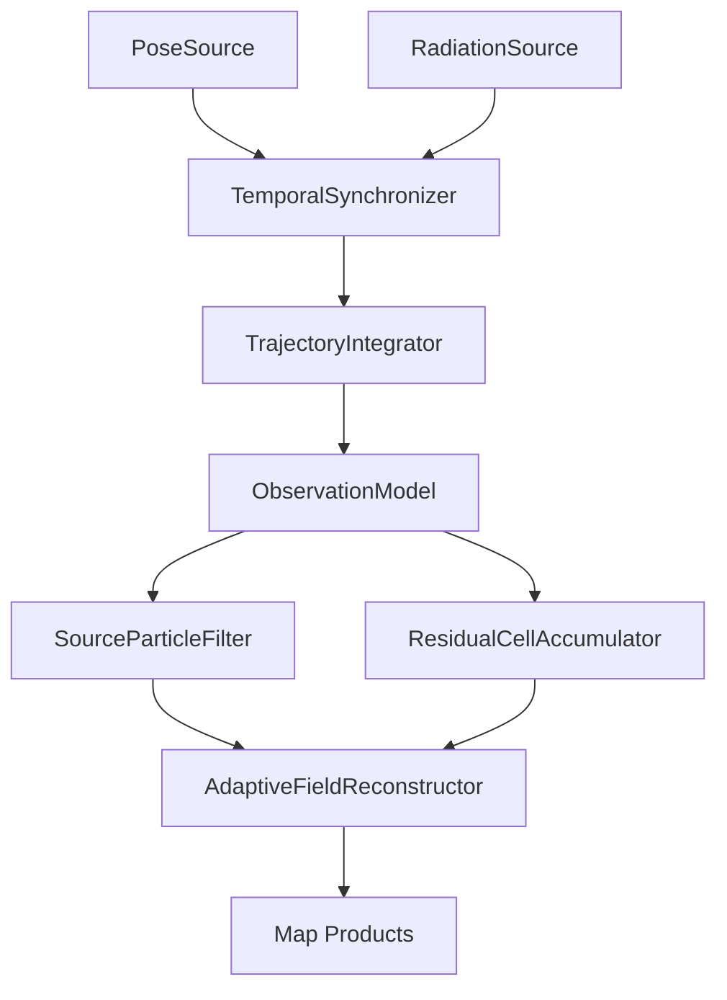

# ARES - Framework de reconstrução radiométrica probabilística

## Especificação técnica para a V0.3

Data: 29/07/2026  
Status: baseline autorizativa para implementação  
Escopo inicial: uma fonte pontual estática, um detector FS-5000 e pose simulada
ou real em um mapa 2D

## 1. Decisão executiva

O núcleo recomendado para a próxima versão do ARES é:

1. **fusão temporal por janela de medição**, reconstruindo o caminho físico do
   detector durante cada leitura;
2. **modelo radiométrico probabilístico**, usando contagens Poisson e a lei do
   inverso do quadrado;
3. **filtro de partículas regularizado**, com custo e memória limitados, para
   estimar posição, intensidade, fundo e existência da fonte;
4. **mapa físico posterior**, recalculado a partir das hipóteses de fonte, de
   modo que cada medição atualize o campo inteiro;
5. **grade quadtree adaptativa**, com células maiores onde o campo varia pouco e
   menores onde há gradiente, probabilidade de fonte ou dados locais relevantes;
6. **mapa residual local**, para corrigir diferenças entre a lei ideal e o campo
   medido, inicialmente com agregação por célula e IDW de vizinhos próximos;
7. **dose acumulada como restrição integral e controle de consistência**, sem
   reutilizá-la como se fosse uma medição independente;
8. **camadas separadas de valor, incerteza, cobertura, exposição e
   probabilidade de fonte**.

Em notação compacta:

\[
\text{pose}(t)+\text{radiação}(t)
\longrightarrow
\text{observação integrada}
\longrightarrow
p(\theta\mid \mathcal D)
\longrightarrow
F(x,y)+\sigma_F(x,y)
\]

onde:

- \(\mathcal D\) é todo o histórico de observações;
- \(\theta\) contém os parâmetros da fonte e do fundo;
- \(F(x,y)\) é a taxa de dose estimada;
- \(\sigma_F(x,y)\) representa a incerteza preditiva.

Esta solução preserva a intenção central do ARES: cada dado novo contribui para
um modelo maior, mas não exige comparações de todos os pontos entre si.

## 2. O que não deve ser usado como núcleo

### 2.1 Triangulação de dois em dois

Uma taxa de dose escalar não fornece direção. Mesmo em espaço livre, duas
leituras não determinam simultaneamente:

- \(x\) da fonte;
- \(y\) da fonte;
- intensidade da fonte;
- taxa de fundo.

Se intensidade e fundo fossem conhecidos, cada leitura definiria uma
circunferência de distância provável e duas circunferências ainda poderiam
produzir duas interseções. Com intensidade ou fundo desconhecidos, o problema é
subdeterminado.

Gerar soluções para todos os pares também teria custo:

\[
O(N^2)
\]

e amplificaria ruído, soluções fantasmas e correlações entre medições.

Decisão: os pares podem existir apenas como ferramenta visual de depuração. A
estimativa operacional deve ajustar todas as evidências conjuntamente.

### 2.2 IDW aplicado diretamente a toda a dose

IDW é rápido e produz uma superfície agradável, mas:

- não usa um modelo de fonte;
- não separa fundo e contribuição da fonte;
- não produz probabilidade calibrada;
- é sensível a ruído e distribuição irregular;
- extrapola de forma arbitrária quando usado fora da cobertura.

Decisão: usar IDW somente para:

- baseline comparativa;
- visualização provisória antes de existir geometria suficiente;
- interpolação local do **resíduo** entre modelo físico e observações.

### 2.3 Processo Gaussiano completo desde a primeira versão

GPR é adequado para mapas ruidosos e irregulares e fornece média e variância,
mas o treinamento exato cresce aproximadamente como:

\[
O(N^3)
\]

O artigo anexado de Zhang et al. relata cerca de 1,2 s para aproximadamente 200
medições em um RK3588. O método obteve bons resultados em um laboratório
controlado com obstáculos, NaI(Tl), SLAM e informação prévia de materiais, mas
isso não corresponde ainda ao ARES com um FS-5000 GM e ambiente inicialmente
desconhecido.

Decisão: GPR multi-kernel não será o núcleo da V0.3. Uma versão **esparsa** poderá
substituir o mapa residual quando houver dados e calibração suficientes.

### 2.4 Filtro de Kalman para "fundir" dose acumulada

A dose acumulada do próprio FS-5000 é derivada do mesmo processo que gera as
taxas e contagens. Tratá-la como medição independente duplicaria informação e
reduziria artificialmente a incerteza.

Além disso, o modelo fonte-distância é fortemente não linear e as contagens são
discretas. Um Kalman linear não é a escolha natural.

Decisão:

- dose acumulada entra como integral, auditoria e recuperação de lacunas;
- um filtro de partículas será usado para a fonte;
- Kalman, UKF ou filtro de informação só poderão ser usados depois em
  subproblemas apropriados, como pose, fonte móvel aproximadamente gaussiana ou
  atualização linear de um mapa residual.

## 3. Base na literatura

| Abordagem | Evidência | Decisão ARES |
|---|---|---|
| Máxima verossimilhança | Gunatilaka, Ristic e Gailis encontraram o MLE como o melhor entre os estimadores comparados para uma fonte pontual | Manter como baseline e diagnóstico |
| Inferência bayesiana | Jarman et al. destacam a representação explícita de incerteza e soluções não únicas | Adotar como princípio |
| Filtro de partículas | Kemp et al. estimam posição, intensidade e número de fontes em ambiente com obstáculos usando contagens e partículas | Adotar versão simples para uma fonte |
| GPR radiométrico | West et al. mostram adequação a dados esparsos, irregulares e de baixa contagem, com incerteza preditiva | Usar como referência para evolução |
| GPR esparso | Kipkosgei et al. obtêm previsão e incerteza com subconjunto de pontos e precisão comparável ao GPR completo | Evolução do mapa residual |
| MK-GPR | Zhang et al. combinam inverso do quadrado e atenuação por materiais, com boa reconstrução em ambiente controlado | Fase futura com obstáculos conhecidos |

Conclusão de engenharia derivada dessas fontes: para a etapa atual, o melhor
equilíbrio entre simplicidade, confiança explícita e custo fixo é um filtro de
partículas com verossimilhança física, usando uma representação adaptativa para
o mapa. GPR esparso entra depois, onde realmente agrega valor: modelar resíduos,
blindagem e irregularidades não explicadas pela fonte pontual.

## 4. Hipóteses autorizadas para a V0.3

### 4.1 Hipóteses iniciais

- mapa horizontal 2D;
- distância radiométrica calculada em 3D;
- uma fonte pontual;
- fonte estática durante cada missão;
- intensidade constante durante cada missão;
- emissão isotrópica;
- fundo espacialmente uniforme;
- ausência inicial de paredes e blindagens radiométricas;
- um FS-5000;
- pose disponível em um referencial métrico comum;
- uma observação radiológica por segundo;
- aproximadamente 20 poses por segundo na simulação.

### 4.2 O estimador não pode conhecer a verdade simulada

O simulador manterá dois estados separados:

```text
truth/
  pose verdadeira
  fonte verdadeira
  campo verdadeiro

observed/
  pose com erro, atraso e deriva
  dados simulados do FS-5000
  perdas, quantização e latência
```

Somente `observed/` alimenta o estimador. `truth/` serve para testes e métricas.

### 4.3 Parâmetro de intensidade

A interface usará:

```text
contribuição da fonte a 1 m [µSv/h]
```

O fundo será configurado separadamente. Assim, se \(q_{1m}\) for a contribuição
da fonte a um metro:

\[
\dot D(\mathbf p)
=
b+
q_{1m}
\left(
\frac{1\ \mathrm m}
{\max(\|\mathbf p-\mathbf s\|,r_{\min})}
\right)^2
\]

O cálculo real usará a coordenada vertical da fonte e do detector. Isso evita a
singularidade quando fonte e detector não ocupam exatamente o mesmo ponto.
Ainda haverá um limite físico mínimo configurável para segurança numérica.

## 5. Referenciais espaciais

Referenciais mínimos:

```text
map
└── odom
    └── base_link
        ├── detector_0
        └── detector_1   # futuro
```

A posição radiométrica não é a posição do centro do robô:

\[
T_{\mathrm{map}}^{\mathrm{detector}_d}(t)
=
T_{\mathrm{map}}^{\mathrm{base}}(t)
T_{\mathrm{base}}^{\mathrm{detector}_d}
\]

Cada montagem deve declarar:

```text
x_m | y_m | z_m | roll_rad | pitch_rad | yaw_rad
```

No robô real, a fonte preferida de posição será `map -> base_link` corrigida por
SLAM. `SportModeState.position` pode servir para integração inicial e
odometria, mas não deve ser assumida como posição global sem deriva.

## 6. Tempo e sincronização

Cada registro deve preservar:

```text
source_time_ns
receive_monotonic_ns
receive_utc_ns
integration_start_ns
integration_end_ns
time_uncertainty_ns
```

O relógio monotônico é autoritativo para ordenar e medir intervalos. UTC serve
para correlação externa.

Para uma leitura radiológica entre \(t_0\) e \(t_1\), o sistema:

1. recupera todas as poses no intervalo;
2. interpola as bordas \(t_0\) e \(t_1\);
3. transforma cada pose da base na pose do detector;
4. constrói uma quadratura temporal do caminho;
5. associa incerteza de posição e sincronização;
6. produz uma única `ObservationWindow`.

Uma leitura não será atribuída automaticamente ao ponto central. Ela será
modelada como medição ao longo do caminho.

## 7. Modelo de observação radiométrica

### 7.1 Campo físico

Para detector \(d\), fonte \(s\) e instante \(t\):

\[
\dot D_d(t)
=
b_d+
q_{1m}
\left(
\frac{1\ \mathrm m}
{r_{\mathrm{eff},d}(t)}
\right)^2
g_d(\alpha(t))
A_d(t)
\]

\[
r_{\mathrm{eff},d}(t)
=
\max(r_d(t),r_{\min,d})
\]

onde:

- \(b_d\): fundo;
- \(q_{1m}\): contribuição da fonte a 1 m;
- \(r_d(t)\): distância fonte-detector;
- \(r_{\min,d}\): limite físico mínimo de proximidade;
- \(g_d\): resposta angular calibrada;
- \(A_d\): fator de atenuação, inicialmente igual a 1.

Na V0.3:

```text
g_d = 1
A_d = 1
```

Os termos permanecem no contrato para permitir a evolução sem quebrar a API.

### 7.2 Contagens

Se \(\eta_d\) for a sensibilidade calibrada em
`cps/(µSv/h)`, a contagem observada \(K_{k,d}\) em uma janela segue:

\[
K_{k,d}\sim\operatorname{Poisson}(\Lambda_{k,d})
\]

\[
\Lambda_{k,d}
=
\int_{t_0}^{t_1}
\eta_d\,\dot D_d(t)\,dt
\]

Por quadratura sobre as poses:

\[
\Lambda_{k,d}
\approx
\sum_{\ell=1}^{L}
\eta_d\,\dot D_d(\mathbf p_{d,\ell})
\Delta t_\ell
\]

Isso incorpora corretamente:

- movimento durante o segundo;
- permanência;
- posição real do detector;
- dois detectores;
- frequência de pose maior que a frequência radiológica.

### 7.3 Modo alternativo por taxa

Enquanto a resposta do FS-5000 não estiver calibrada, haverá:

```text
observation_mode: dose_rate_robust
```

Nesse modo, `DR` será a variável principal e a verossimilhança usará uma
distribuição Student-t ou Normal heteroscedástica com variância obtida em ensaio.

O modo preferido depois da calibração será:

```text
observation_mode: counts_poisson
```

`CPS` e `DR` não serão usados simultaneamente como duas observações
independentes.

### 7.4 Sobre-dispersão

Se ensaios estáticos mostrarem variância significativamente maior que a média,
o sistema trocará Poisson por binomial negativa, preservando a mesma interface:

\[
K\sim\operatorname{NegBin}(\mu,\phi)
\]

Essa decisão será baseada em calibração, não em preferência estética.

## 8. Uso correto dos campos do FS-5000

O fluxo observado contém:

```text
DR | D | CPS | CPM | AVG | DT | S | W
```

| Campo | Papel no ARES |
|---|---|
| `CPS` | observação primária para verossimilhança Poisson após calibração |
| `DR` | mapa em µSv/h, modo alternativo de observação e comparação com contagens |
| `CPM` | estimativa móvel correlacionada; validação e exibição, não nova evidência |
| `AVG` | média temporal correlacionada; telemetria e verificação |
| `D` | integral quantizada; fechamento, lacunas e exposição |
| `DT` | duração da medição temporizada |
| `S` | dose integrada da medição temporizada |
| `W` | alarme, saturação ou estado operacional |

### 8.1 Evidência dos arquivos reais

O CSV real disponível possui:

- 1.390 registros;
- 1.388 s entre primeiro e último timestamp;
- cadência nominal de aproximadamente 1 Hz;
- 38 timestamps repetidos e 37 saltos de 2 s devido à resolução de um segundo;
- `DR` entre 0,05 e 0,27 µSv/h;
- `CPS` entre 0 e 3;
- `CPM` entre 13 e 36;
- incremento de `D` em passos de 0,01 µSv.

Resultados de consistência:

```text
integral de DR no período: 0,06086 µSv
variação registrada em D: 0,06 µSv
autocorrelação lag-1 de DR: 0,989
autocorrelação lag-1 de CPM: 0,981
autocorrelação lag-1 de CPS: 0,081
```

Interpretação:

- `CPS` é o canal mais próximo da contagem instantânea;
- `DR`, `CPM` e `AVG` possuem forte memória temporal;
- `D` reproduz a integral da taxa, dentro de sua quantização;
- esses canais não podem ser multiplicados como evidências independentes.

### 8.2 Timestamp do coletor

O `fs5000.py` atual cria timestamp apenas até segundos. O adaptador novo deverá
registrar o instante de chegada com `monotonic_ns()` imediatamente após validar
cada pacote e manter o payload ASCII original.

## 9. Dados do Unitree Go2

O contrato oficial `SportModeState` expõe:

```text
stamp
error_code
imu_state
mode
progress
gait_type
foot_raise_height
position[3]
body_height
velocity[3]
yaw_speed
range_obstacle[4]
foot_force[4]
foot_position_body[12]
foot_speed_body[12]
```

`IMUState` contém quaternion, giroscópio, acelerômetro, RPY e temperatura.

O exemplo oficial apresenta grupos de mensagens separados por cerca de 50 ms.
A simulação usará 20 Hz, mas isso não será tratado como garantia do firmware.
Na integração real, o adaptador medirá:

```bash
ros2 topic hz /sportmodestate
```

ou o tópico efetivamente escolhido.

### 9.1 O que contribui diretamente para a reconstrução

| Dado do Go2 | Uso |
|---|---|
| posição e orientação | posição física de cada detector |
| timestamp | sincronização |
| velocidade | integração e controle de qualidade |
| IMU | qualidade de pose, vibração e orientação |
| altura do corpo | coordenada vertical do detector |
| marcha e modo | diagnóstico de qualidade |
| obstáculos | geometria futura e planejamento |
| pés e forças | diagnóstico; sem peso radiométrico direto |

Dados sem modelo físico explícito serão registrados, mas não alterarão a
confiança do mapa.

### 9.2 Covariância de pose

`SportModeState` não fornece uma matriz de covariância autoritativa. O adaptador
deverá receber covariância do SLAM ou aplicar um modelo conservador configurado.

Nenhuma célula deve ter resolução significativamente menor que a incerteza
espacial da pose.

## 10. Estimador bayesiano da fonte

### 10.1 Hipóteses e estado das partículas

O sistema manterá duas hipóteses paralelas:

```text
H0: somente fundo
H1: fundo mais uma fonte pontual
```

Em `H1`, cada partícula representa:

\[
\theta_j=
(x_s,y_s,\log q_{1m},\log b)
\]

O estado em log garante intensidade e fundo positivos.

`H0` mantém somente a distribuição do fundo. As probabilidades
`p(H0 | dados)` e `p(H1 | dados)` serão atualizadas pelas evidências marginais
dos dois modelos. Isso evita que partículas de fonte e de fundo disputem
reamostragem dentro do mesmo conjunto.

### 10.2 Priors

Valores iniciais:

- \(x_s,y_s\): uniforme dentro do mapa;
- \(q_{1m}\): log-uniforme dentro dos limites configurados;
- \(b\): distribuição obtida em ensaio de fundo;
- existência de fonte: probabilidade configurável, inicialmente neutra.

O valor verdadeiro configurado no simulador nunca será usado como prior sem uma
opção explícita de teste.

### 10.3 Atualização

Para cada `ObservationWindow`:

1. calcular \(\Lambda_{k,d}^{(j)}\) para todas as partículas;
2. calcular log-verossimilhança;
3. somar aos log-pesos;
4. normalizar por `logsumexp`;
5. calcular tamanho efetivo:

\[
ESS=\frac{1}{\sum_j w_j^2}
\]

6. se `ESS < 0,5 P`, executar reamostragem sistemática;
7. regularizar as partículas por Liu-West ou passo MCMC curto;
8. preservar limites físicos e mapa;
9. atualizar as probabilidades de `H0` e `H1`.

Configuração inicial:

```text
particles: 2048
resample_ess_fraction: 0.50
rejuvenation_method: liu_west
liu_west_h: 0.10
```

### 10.4 Por que o custo não cresce com o histórico

Cada leitura exige:

\[
O(P\cdot L\cdot D)
\]

onde:

- \(P\): partículas;
- \(L\): poses na janela;
- \(D\): detectores.

Com 2.048 partículas, 20 poses por segundo e um detector:

```text
40.960 avaliações do modelo por medição
```

Com dois detectores:

```text
81.920 avaliações por medição
```

O histórico anterior já está resumido nos pesos e no estado posterior. Não há
comparação de todos os pontos.

### 10.5 Saída de fonte

O estimador deve produzir:

```text
p_source_exists
posterior_mean_x_y
posterior_map_x_y
posterior_median_strength_at_1m
posterior_background
credible_region_50
credible_region_90
credible_region_95
effective_sample_size
identifiability_state
```

A fonte só será mostrada como detectada quando:

```text
p_source_exists >= 0.95
e
limite inferior de q_1m > limiar de detecção
e
geometria observacional suficiente
```

Isso evita forçar uma fonte inexistente em dados de fundo.

## 11. Região de confiança

A região primária será uma região de credibilidade de maior densidade posterior
contendo \(Y\%\) da massa das partículas.

Ela pode ser:

- multimodal;
- alongada;
- desconectada;
- aproximadamente elíptica somente após convergência.

Se a interface exigir um raio:

\[
R_Y=
\min\{r:\Pr(\|\mathbf s-\hat{\mathbf s}\|\le r)\ge Y\}
\]

Esse círculo será rotulado como resumo conservador. A região real continuará
disponível no mapa.

### 11.1 Geometria insuficiente

Uma trajetória quase retilínea pode produzir ambiguidade espelhada. Repetir
leituras no mesmo ponto melhora a precisão da taxa local, mas pouco melhora a
localização.

O sistema avaliará:

- dispersão espacial das posições;
- ângulo coberto em relação às hipóteses de fonte;
- condição da matriz de informação;
- entropia da posterior;
- número efetivo de células independentes.

Estados:

```text
INSUFFICIENT
MULTIMODAL
CONVERGING
STABLE
MODEL_MISMATCH
```

## 12. Reconstrução do mapa

### 12.1 Campo físico posterior

Para cada célula \(c\):

\[
F_{\mathrm{phys}}(c)
=
\sum_j w_j F(c;\theta_j)
\]

Os quantis das previsões das partículas fornecem:

```text
p05 | p50 | mean | p95 | std
```

Cada medição muda os pesos das hipóteses e, portanto, pode corrigir o mapa
inteiro sem transformar pixels previstos em novas medições.

### 12.2 Campo residual

O campo final será:

\[
F(c)=F_{\mathrm{phys}}(c)+R(c)
\]

O resíduo de uma observação é:

\[
e_k=y_k-\widehat y_{k,\mathrm{phys}}
\]

Cada janela gera uma linha esparsa \(H_k\), cujos coeficientes representam a
fração de tempo passada em cada célula:

\[
e_k=H_kR+\varepsilon_k
\]

O acumulador residual manterá, por célula:

```text
weighted_time_s
weighted_residual_sum
weighted_residual_sq_sum
effective_observations
last_update_ns
quality_sum
```

Na V0.3, a superfície residual será interpolada apenas com os \(k\) vizinhos
ocupados mais próximos:

```text
k: 8
power: 2
maximum_support_radius: 3 x cell_size
```

Fora do suporte local, o resíduo tende a zero e a incerteza aumenta. O IDW não
será usado para extrapolar o campo inteiro.

### 12.3 Evolução para GPR esparso

Quando houver dados suficientes:

```text
ResidualIDW -> SparseResidualGP
```

O GPR esparso usará um número limitado de pontos indutores. Sua função será
modelar:

- blindagens;
- obstáculos;
- espalhamento;
- anisotropia;
- erros persistentes do modelo pontual.

O modelo físico continuará sendo a média estruturada; o GP aprenderá somente o
que ele não explica.

## 13. Grade adaptativa

### 13.1 Por que usar quadtree

A quadtree limita memória e processamento e permite gastar resolução onde ela
tem significado físico.

Não se deve refinar apenas porque a dose é alta. Uma região de dose baixa pode
conter:

- uma fonte blindada;
- uma fronteira de obstáculo;
- alta incerteza;
- uma segunda fonte futura.

### 13.2 Critérios de refinamento

Uma célula será dividida quando pelo menos uma condição for satisfeita:

1. variação relativa prevista entre centro e cantos maior que 15%;
2. interseção com a região de credibilidade da fonte;
3. massa posterior de posição de fonte acima do limiar;
4. presença de medições com resíduos espacialmente incompatíveis;
5. fronteira de cobertura ou obstáculo relevante;
6. solicitação explícita de resolução pelo operador.

Ela poderá ser unida quando todas as condições ficarem abaixo de metade dos
limiares por cinco atualizações consecutivas.

Essa histerese evita divisão e união oscilantes.

### 13.3 Limite físico de resolução

\[
h_{\min}
=
\max
\left(
0,5\ \mathrm m,\,
2\sigma_{\mathrm{pose}},\,
\frac{v_{95}T_{\mathrm{int}}}{2}
\right)
\]

O valor de 0,5 m é a baseline inicial, não uma verdade universal.

Exceções:

- medições estacionárias e SLAM de alta precisão poderão usar 0,25 m;
- GPS de celular exigirá células de vários metros;
- pose com grande deriva deve ampliar a célula, não criar falsa precisão.

### 13.4 Configuração recomendada para 50 x 50 m

```text
cell_far_m: 2.0
cell_default_m: 1.0
cell_near_m: 0.5
cell_min_m: 0.5
refine_relative_variation: 0.15
merge_hysteresis_updates: 5
```

Para manter tamanhos binários exatos, a raiz da quadtree será preenchida até o
próximo quadrado de potência de dois. Um mapa de 50 x 50 m poderá usar raiz
interna de 64 x 64 m, mantendo fora da área operacional células mascaradas.

Comparação aproximada:

| Representação | Células |
|---|---:|
| grade fixa de 2 m | 625 |
| grade fixa de 1 m | 2.500 |
| grade fixa de 0,5 m | 10.000 |
| 2 m longe e 0,5 m em raio de 5 m | aproximadamente 920 |

Com 256 amostras posteriores para renderização, a opção adaptativa exige cerca
de 235 mil avaliações por quadro, contra 2,56 milhões em uma grade fixa de
0,5 m.

### 13.5 Duas resoluções diferentes

O software deve separar:

1. **grade de estatísticas observadas**, usada para cobertura e resíduos;
2. **grade de renderização**, adaptativa e recalculável.

Alterar a resolução visual não apaga nem reagrupa destrutivamente os dados
brutos.

## 14. Incerteza do mapa

Cada célula deve mostrar:

```text
mean_uSv_h
p05_uSv_h
p50_uSv_h
p95_uSv_h
relative_uncertainty
probability_above_threshold
coverage_time_s
distance_to_support_m
```

A incerteza total inclui:

- posterior de posição, intensidade e fundo;
- estatística radiológica;
- incerteza de pose;
- sincronização;
- calibração do detector;
- variabilidade residual;
- inadequação do modelo.

Na V0.3, as componentes serão propagadas por amostragem Monte Carlo leve na
renderização. Somar variâncias só será usado como fallback documentado.

### 14.1 Confiança não é apenas distância do robô

O suporte é anisotrópico e depende da trajetória. O produto principal será um
mapa de incerteza por célula.

Um resumo opcional será:

\[
R_{Y,\epsilon}
=
\max\left\{
r:
\Pr\left(
\frac{|F-\hat F|}{\max(\hat F,\epsilon_0)}
\le\epsilon
\right)\ge Y
\text{ nas células do disco}
\right\}
\]

Exemplo de interface:

```text
raio conservador com erro relativo <= 25% a 90%: 6,2 m
```

O mapa espacial continuará sendo autoritativo.

### 14.2 Calibração da confiança

Um número como 95% é inicialmente **condicional ao modelo**. Antes de uso real,
deve ser calibrado:

- em simulação, verificar em muitas sementes quantas vezes a verdade fica
  dentro do intervalo de 95%;
- em ensaio controlado, ocultar pontos e medir cobertura preditiva;
- ampliar intervalos se a cobertura observada ficar abaixo da nominal.

Uma medição conflitante pode aumentar a incerteza. Confiança não deve ser
forçada a crescer monotonicamente.

## 15. Dose acumulada e permanência

### 15.1 Relação integral

\[
\Delta D
=
\frac{1}{3600}
\int_{t_0}^{t_1}
F(\mathbf p_d(t),t)\,dt
\]

com \(F\) em µSv/h e tempo em segundos.

### 15.2 Regra de não duplicação

| Situação | Uso de `D` ou `S` |
|---|---|
| todas as taxas/contagens presentes | somente auditoria |
| pacotes instantâneos ausentes | observação integral do trecho faltante |
| reset ou diminuição de `D` | evento de reset; não fundir |
| incremento menor que a quantização | não extrair localização |
| intervalo desconhecido | registrar, sem espacializar |
| `S/DT` não sobreposto | restrição integral válida |

### 15.3 Exposição da missão

A dose recebida será um produto separado:

```text
mission_exposure/
  cumulative_detector_dose
  cumulative_robot_path_dose
  dose_by_path_segment
  time_above_threshold
```

Permanecer em um local:

- aumenta contagens;
- reduz incerteza estatística;
- aumenta dose acumulada;
- não aumenta a taxa ambiental verdadeira.

## 16. Contratos de dados

### 16.1 `PoseSample`

```text
schema_version
mission_id
source_id
sequence
source_time_ns
receive_monotonic_ns
frame_id
child_frame_id
x_m y_m z_m
qx qy qz qw
vx_m_s vy_m_s vz_m_s
yaw_rate_rad_s
position_covariance
orientation_covariance
quality
raw_payload
truth                # somente namespace de simulação
```

### 16.2 `RadiationSample`

```text
schema_version
mission_id
sensor_id
sequence
receive_monotonic_ns
integration_start_ns
integration_end_ns
integration_time_s
dose_rate_uSv_h
cumulative_dose_uSv
cps
cpm
average_dose_rate_uSv_h
timer_s
timed_dose_uSv
alarm
quality
calibration_id
raw_payload
truth                # somente namespace de simulação
```

### 16.3 `ObservationWindow`

```text
radiation_sample
detector_path[]
path_time_weights[]
pose_covariances[]
extrinsic_transform
maximum_pose_gap_ms
sync_error_ms
quality_flags[]
```

### 16.4 `SourcePosterior`

```text
particles
log_weights
p_source_exists
credible_regions
entropy
effective_sample_size
identifiability_state
model_diagnostics
```

### 16.5 `FieldCell`

```text
bounds
level
center
posterior_mean
posterior_quantiles
residual_mean
residual_variance
coverage_time_s
effective_observations
last_update_ns
refinement_reason
```

## 17. Arquitetura de software



Módulos:

```text
providers/
  PoseSource
  RadiationSource
  SimulatedPoseSource
  ManualKeyboardPoseSource
  UnitreeSportModePoseSource
  RosTfPoseSource
  SimulatedFS5000Source
  FS5000SerialSource
  ReplayPoseSource
  ReplayRadiationSource

fusion/
  TemporalSynchronizer
  TrajectoryIntegrator
  ObservationBuilder

inference/
  RadiationObservationModel
  SourceExistenceModel
  RegularizedParticleFilter
  IdentifiabilityMonitor

mapping/
  ObservationGrid
  AdaptiveQuadtree
  ResidualCellAccumulator
  ResidualIDW
  AdaptiveFieldReconstructor
  ConfidenceCalibrator

products/
  DoseRateLayer
  UncertaintyLayer
  CoverageLayer
  ExposureLayer
  SourceProbabilityLayer

storage/
  MissionStore
  RawEventLog
  ReplayService
```

## 18. Modos de execução

| Pose | Radiação | Uso |
|---|---|---|
| simulada manual | simulada | desenvolvimento completo |
| simulada manual | FS-5000 real | teste de bancada e grade manual |
| Go2 ou MuJoCo | simulada | integração robótica sem fonte |
| Go2 real | FS-5000 real | missão real |
| replay | replay | reprodução determinística |

Os módulos de inferência e mapa não conhecerão qual combinação está ativa.

## 19. Simulador

### 19.1 Mundo

O operador poderá:

- definir largura e altura do mapa;
- clicar para criar ou mover a fonte;
- definir contribuição em µSv/h a 1 m;
- definir fundo;
- iniciar, pausar e reiniciar;
- alterar intensidade ao longo do tempo;
- mover o Go2 com setas;
- mostrar ou ocultar a verdade;
- introduzir ruído, atraso, deriva e perda;
- gravar eventos para replay.

### 19.2 Go2 simplificado

- retângulo de 0,70 x 0,31 m;
- pose completa da base;
- detector em extrínseca configurável;
- publicação observada a 20 Hz;
- velocidade configurável;
- controle por posição ou velocidade;
- colisão com limites do mapa;
- ruído e deriva opcionais.

### 19.3 FS-5000 simulado

Saída a 1 Hz:

```text
DR | D | CPS | CPM | AVG | DT | S | W
```

Comportamentos:

- `CPS`: sorteio de contagem;
- `CPM`: soma móvel das contagens;
- `DR`: transformação calibrada, filtrada e quantizada;
- `AVG`: média definida pelo perfil de firmware;
- `D`: integral quantizada em 0,01 µSv;
- `DT/S`: medição temporizada;
- `W`: estado de alarme;
- atraso de resposta configurável;
- pacote bruto com o formato real.

O perfil exato de suavização será substituído pelos resultados de calibração.

## 20. Interface operacional

Objetivo: caber em 1920 x 1080 a 100% de zoom.

Layout:

```text
┌──────────────────────────────────────────────────────┐
│ estado | tempo | leituras | confiança | FPS         │
├─────────────────────────────────┬────────────────────┤
│                                 │ fonte simulada     │
│             MAPA                │ intensidade a 1 m  │
│                                 │ fundo              │
│                                 │ iniciar/pausar     │
│                                 │ camadas            │
├─────────────────────────────────┴────────────────────┤
│ legenda e avisos                                    │
└──────────────────────────────────────────────────────┘
```

Camadas:

```text
taxa estimada
incerteza
cobertura
exposição
probabilidade de fonte
pontos medidos
trajetória
verdade simulada
```

Ao apontar uma célula:

```text
estimativa: 1,42 µSv/h
intervalo de 90%: 1,10-1,91 µSv/h
tempo medido: 8,0 s
origem: 72% modelo / 28% resíduo local
distância ao suporte: 0,4 m
```

O hotspot estimado e a fonte verdadeira devem usar símbolos distintos.

## 21. Concorrência e desempenho

### 21.1 Princípio

Aquisição nunca espera o renderizador.

Filas:

```text
pose_queue          # alta frequência
radiation_queue     # 1 Hz
observation_queue
map_snapshot_queue  # último valor vence
```

Workers:

```text
pose acquisition
radiation acquisition
temporal fusion
posterior update
map reconstruction
persistence
websocket/UI
```

### 21.2 Cadências

```text
pose ingest: 20 Hz simulados; real medido
radiation ingest: 1 Hz
posterior update: a cada leitura
map snapshot: 1 Hz
UI animation: até 20 Hz com último mapa pronto
persistence flush: lote de 1-5 s
```

### 21.3 Limites iniciais

```text
source particles: 2048
render particles: 256
maximum active quadtree leaves: 5000
maximum pose history in RAM: 120 s
raw mission history: disco
residual neighbors: 8
```

Metas de desempenho:

```text
p95 posterior update < 50 ms
p95 map reconstruction < 250 ms
no radiation sample dropped at 1 Hz
RAM approximately constant during 8 h
```

As metas deverão ser medidas novamente no computador embarcado definitivo.

## 22. Calibração necessária antes de confiança real

### 22.1 FS-5000

1. fundo estático por pelo menos 30 min;
2. fonte controlada em 0,5, 1, 2, 3 e 4 m;
3. pelo menos 5 min por distância;
4. degrau de intensidade para medir atraso e suavização de `DR`;
5. comparação `CPS`, `CPM`, `DR`, `AVG` e `D`;
6. quantização e reset de dose acumulada;
7. resposta angular em passos de 15 graus;
8. repetição para estimar variância entre ensaios;
9. caracterização de saturação e alarme dentro de condições autorizadas.

Resultados:

```text
sensitivity_cps_per_uSv_h
background_cps
overdispersion
response_time_s
effective_window_s
dose_quantization_uSv
angular_response_table
calibration_uncertainty
```

### 22.2 Go2 e SLAM

1. medir frequência efetiva;
2. medir atraso e jitter;
3. percurso fechado para deriva;
4. comparação com distâncias conhecidas;
5. covariância por condição de marcha;
6. medir extrínsecas detector-base;
7. testar timestamp comum e reordenação de pacotes.

## 23. Dois detectores

Cada detector terá trajetória, calibração e verossimilhança próprias:

\[
p(\mathcal D\mid\theta)
=
\prod_d\prod_k
p(K_{k,d}\mid\theta)
\]

Isso só vale como independência condicional depois de verificar correlação entre
canais.

A assimetria:

\[
A=\frac{C_E-C_D}{C_E+C_D}
\]

será um produto derivado. Não será adicionada à verossimilhança junto com as
contagens brutas, pois isso reutilizaria a mesma informação.

O simulador deverá variar:

```text
separação
altura
posição longitudinal
yaw
inclinação
blindagem
resposta angular
sombreamento do corpo
```

Métricas de montagem:

- erro de localização;
- cobertura da região de 95%;
- tempo até convergência;
- entropia posterior;
- acerto do lado provável;
- robustez a orientação;
- ganho de informação por dose recebida;
- sensibilidade a desalinhamento.

## 24. Obstáculos e múltiplas fontes

Não entram na implementação inicial.

Evolução:

### 24.1 Obstáculos conhecidos

\[
A_d(t)=
\exp\left(
-\sum_m \mu_m(E)\ell_m(t)
\right)
\]

Os comprimentos atravessados poderão ser pré-calculados no mapa, como nos
trabalhos com kernels de atenuação.

### 24.2 Obstáculos desconhecidos

- residual estruturado;
- GPR esparso;
- aumento explícito de incerteza;
- detecção de inadequação do modelo.

### 24.3 Múltiplas fontes

\[
F(\mathbf p)
=
b+
\sum_{j=1}^{J}
\frac{q_j}{\|\mathbf p-\mathbf s_j\|^2}
\]

O número \(J\) não será aumentado automaticamente sem seleção de modelo. A fase
futura poderá usar partículas com cardinalidade, filtros paralelos ou
RJMCMC.

## 25. Testes obrigatórios

### 25.1 Unidade

- transformação base-detector;
- interpolação temporal;
- quadratura de trajetória;
- verossimilhança Poisson;
- normalização de log-pesos;
- ESS e reamostragem;
- região de credibilidade;
- divisão e união da quadtree;
- fechamento de dose acumulada;
- não duplicação entre `CPS`, `DR`, `CPM` e `D`.

### 25.2 Propriedades

- pesos sempre finitos e normalizados;
- estimativas de dose não negativas;
- nenhuma verdade simulada entra no estimador;
- alterar resolução visual não altera dados brutos;
- replay com a mesma semente reproduz o mesmo resultado;
- custo de atualização não depende de \(N^2\);
- fonte ausente não produz localização estável.

### 25.3 Cenários

1. somente fundo;
2. fonte única forte;
3. fonte única fraca;
4. trajetória retilínea ambígua;
5. trajetória envolvendo a fonte;
6. permanência em um ponto;
7. movimento rápido durante a janela;
8. perda de pose;
9. perda de radiação;
10. timestamp atrasado;
11. deriva de odometria;
12. degrau de intensidade;
13. fonte móvel em modo futuro;
14. dose acumulada com pacotes faltantes;
15. dois detectores simulados.

## 26. Métricas e critérios de aceite

### 26.1 Cenário de referência

```text
mapa: 20 x 20 m
fonte: uma, estática
fundo: 0,15 µSv/h
intensidade: 10 µSv/h a 1 m
pose: sigma de 0,10 m
trajetória: diversidade angular >= 90 graus
medições: 60 a 1 Hz
```

Metas:

- erro mediano de fonte menor ou igual a 0,5 m;
- verdade dentro da região nominal de 95% em 90%-98% de 100 execuções;
- falso positivo de fonte menor que 5% em fundo puro;
- sem amostras perdidas por processamento;
- fechamento de dose dentro da quantização e incerteza calibradas;
- mapa distingue observação, previsão e região sem suporte residual.

### 26.2 Métricas gerais

```text
source_position_error_m
source_strength_relative_error
background_error
credible_region_coverage
credible_region_area
field_RMSE
field_MAE
negative_log_predictive_density
interval_coverage
false_source_probability
time_to_stable
posterior_entropy
update_latency_p95
render_latency_p95
memory_growth
```

## 27. Configuração inicial

```yaml
mission:
  mode: simulated
  seed: 42

world:
  width_m: 50.0
  height_m: 50.0
  background_uSv_h: 0.15

pose:
  provider: manual_sim
  output_rate_hz: 20.0
  position_std_m: 0.05
  latency_ms: 20.0

radiation:
  provider: fs5000_sim
  output_rate_hz: 1.0
  integration_time_s: 1.0
  observation_mode: dose_rate_robust
  sensitivity_cps_per_uSv_h: null
  cumulative_quantization_uSv: 0.01

source_truth:
  enabled: true
  x_m: 35.0
  y_m: 25.0
  z_m: 0.0
  contribution_at_1m_uSv_h: 10.0

inference:
  model: single_source_particle_filter
  particles: 2048
  render_particles: 256
  resample_ess_fraction: 0.50
  rejuvenation: liu_west
  liu_west_h: 0.10
  source_exists_threshold: 0.95

grid:
  type: quadtree
  far_cell_m: 2.0
  default_cell_m: 1.0
  near_cell_m: 0.5
  minimum_cell_m: 0.5
  maximum_leaves: 5000
  refine_relative_variation: 0.15
  merge_hysteresis_updates: 5

residual:
  method: local_idw
  neighbors: 8
  power: 2.0
  maximum_support_cells: 3.0

cadence:
  posterior_update_hz: 1.0
  map_update_hz: 1.0
  ui_animation_hz: 20.0
```

## 28. Sequência de implementação

### V0.3-A - contratos e trajetória

- novos timestamps;
- `ObservationWindow`;
- caminho do detector;
- separação completa entre verdade e observado.

### V0.3-B - inferência

- modelo com e sem fonte;
- filtro de partículas;
- verossimilhança por taxa robusta;
- regiões de credibilidade;
- identificabilidade.

### V0.3-C - campo

- mapa posterior físico;
- quadtree;
- cobertura;
- residual local;
- incerteza por célula.

### V0.3-D - FS-5000 fiel

- todos os campos;
- filtros e quantização;
- regra de não duplicação;
- dose acumulada e lacunas.

### V0.3-E - interface e validação

- mapa simplificado;
- camadas;
- fonte clicável;
- Go2 por setas;
- cenários e testes Monte Carlo;
- benchmark.

## 29. Roadmap posterior

```text
V0.3  uma fonte, um detector, posterior e quadtree
V0.4  calibração real e modos mistos
V0.5  dois detectores e estudo de montagem
V0.6  SLAM real e mapa de obstáculos
V0.7  GPR esparso residual
V0.8  fonte móvel e intensidade variável
V0.9  múltiplas fontes
V1.0  integração completa Go2 + detectores
```

## 30. Prompt de implementação

No próximo passo, usar:

> Implemente integralmente a V0.3 do ARES Radiation Mapper conforme
> `docs/probabilistic_reconstruction_framework_v0.3.md`. Trate o documento como
> especificação autorizativa. Preserve os adaptadores e contratos compatíveis da
> V0.2, substitua o estimador atual pelo pipeline probabilístico descrito, crie
> testes determinísticos e Monte Carlo, valide desempenho e interface em
> 1920 x 1080 e entregue um pacote executável com documentação de instalação.

## 31. Referências

1. West, A. et al. *Use of Gaussian process regression for radiation mapping of
   a nuclear reactor with a mobile robot*. Scientific Reports 11, 13975 (2021).
   <https://doi.org/10.1038/s41598-021-93474-4>
2. Gunatilaka, A.; Ristic, B.; Gailis, R. *On Localisation of a Radiological
   Point Source* (2007).
   <https://doi.org/10.1109/IDC.2007.374556>
3. Jarman, K. D. et al. *Bayesian Radiation Source Localization*. Nuclear
   Technology 175, 326-334 (2011).
   <https://doi.org/10.13182/NT10-72>
4. Hellfeld, D. et al. *Gamma-Ray Point-Source Localization and Sparse Image
   Reconstruction Using Poisson Likelihood*. IEEE Transactions on Nuclear
   Science 66, 2088-2099 (2019).
   <https://doi.org/10.1109/TNS.2019.2930294>
5. Kemp, S. et al. *Real-Time Radiological Source Term Estimation for Multiple
   Sources in Cluttered Environments*. IEEE Transactions on Nuclear Science 70,
   2406-2419 (2023).
   <https://doi.org/10.1109/TNS.2023.3324847>
6. Kipkosgei, C. A. et al. *Mapping radioactive environments by use of sparse
   Gaussian processes regression*. Annals of Nuclear Energy 200, 110393 (2024).
   <https://doi.org/10.1016/j.anucene.2024.110393>
7. Zhang, S. et al. *Radiation Mapping: A Gaussian Multi-Kernel Weighting Method
   for Source Investigation in Disaster Scenarios*. Sensors 25, 4736 (2025).
   <https://doi.org/10.3390/s25154736>
8. Unitree Robotics. *unitree_ros2*.
   <https://github.com/unitreerobotics/unitree_ros2>
9. Unitree Robotics. *unitree_mujoco*.
   <https://github.com/unitreerobotics/unitree_mujoco>
10. Bosean. *FS-5000 Nuclear Radiation Detector*.
    <https://bosean.net/FS-5000-Nuclear-Radiation-Detector-2.html>
11. Brooks, T. *Serial interface to Bosean FS-5000 radiation detector*.
    <https://gist.github.com/brookst/bdbede3a8d40eb8940a5b53e7ca1f6ce>
